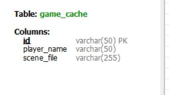
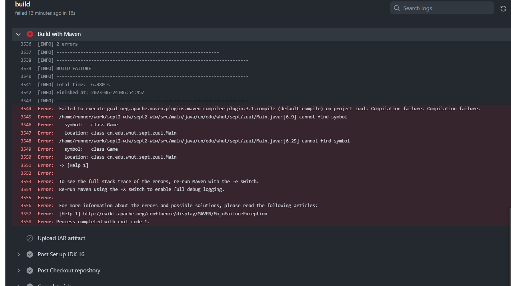

# 软件工程实践二
## 一、实践任务简述
### 1.任务目的
* 巩固强化软件编程规范
* 提高面向对象软件建模与抽象能力
* 培养小组协同开发能力
* 掌握基于Maven的软件项目管理机制
* 掌握基于GitHub的小组协同开发工具和平台
* 了解DevOps软件开发流程
### 2.任务要求
* 基于软件工程实践一中完成的项目基础,以小组为开发单位,采用迭代递进的实践过程逐步掌握课程内容
* 通过实践理解、掌握和应用软件工程的思路、方法、技术和工具
* 从实践任务中培养小组软件工程能力
### 3.任务分析
#### (1)主要内容
* 软件架构设计:基于软件架构及软件开发框架相关知识,对巨洞冒险项目采用适当架构进行设计与开发
* 软件过程与项目管理:基于DevOps体系,采用适当的小组软件过程与项目管理工具进行项目开发与管理
* 软件分支管理:掌握主要软件分支管理模型的概念,及相关工具在软件开发中的应用
* 软件代码评审:掌握代码评审的概念与方法及相关工具在软件开发中的应用
* 持续集成与部署:掌握集成部署的概念与方法及相关工具在软件开发中的应用
#### (2)实践重点
* 小组软件开发阶段的划分
* 项目管理平台的搭建与使用
* 开发任务的分派与跟踪
## 二、项目需求分析
### 1.功能需求
* 创建和管理游戏中的房间、道具和NPC
* 玩家能够在游戏中移动和交互,使用道具与NPC互动
* 在游戏中为房间和道具添加文本描述,帮助玩家推进游戏过程
* 在GUI界面合理设置按钮和文本框等组件,接收玩家的点击和输入,并给予相应的反馈
* 使用mysql数据库完成保存和加载游戏
* 提供帮助和退出游戏提醒等辅助功能
### 2.非功能需求
* **性能**:系统能够及时响应玩家的输入并处理游戏逻辑
* **可伸缩性**:系统需要具备可伸缩性,能够支持多个房间和交互事件,维持游戏的流畅和稳定
* **安全性**:保证玩家的信息不被盗用或泄露,避免黑客攻击和数据丢失等安全问题
* **可用性**:系统的提示和错误信息等方面具备易用性,提高玩家的游戏体验
* **易用性**:系统界面应该简单直观,使得玩家容易操作使用
* **可维护性**:系统源代码应易于理解和修改,便于维护更新,代码的可重用性需要提高,方便后续功能的改进拓展
* **可测试性**:系统代码应易于调试测试,尽可能避免异常的抛出,保证代码质量

### 3.用例图设计

### 4.数据库设计
主要是对加载和保存游戏时,需要将文件存入数据库,我们只存储文件路径在数据库中,而不去存储整个的场景字符流,数据表设置如下。

## 三、技术路线
### 1.开发技术与框架
#### (1)主要技术和工具
* Git版本控制工具
* Github
* Maven项目工程管理
* JavaFx
* Junit单元与集成测试
* DevOps软件开发过程
* MySQL数据库
* MarkDown
#### (2)项目框架简介
World of zuul项目的构建主要使用了Maven软件项目管理构建工具,通过其组织和关系项目的依赖关系,构架和打包应用程序。同时本游戏使用JavaFX来构架跨平台桌面应用程序的GUI界面,其具有跨平台支持、现代化的图形和控件、富媒体支持、灵活的布局管理、强大的图形渲染引擎、CSS 样式支持以及丰富的集成能力等优点。在实践项目的pom.xml 配置文件中定义了项目的依赖项,包括所需的库和版本号。

在实践过程中充分利用 Maven 和 JavaFX 的优势,提高开发效率、简化依赖管理,创建出稳定的易维护的应用程序。
### 四、设计模式
World of zuul项目中采用MVC模式,同时在写后端逻辑时采用了外观模式的Java设计模式。
#### (1)MVC模式
该项目中的 MVC模式将系统分为了三个逻辑部分:
* Model层:包含游戏的逻辑处理和数据管理,例如玩家角色、房间、NPC等。
* View层:包含游戏的GUI界面呈现和交互事件处理,例如游戏界面、JavaFX界面控件、按钮、文本框、项目图片等。
* Controller层:连接Model层和View层,协调游戏逻辑和视觉效果的交互配合,监听 View 层的事件,传递相应的指令到 Model 层对游戏进行相应更新。

上图是本项目的代码结构,其中GlueCode包下为程序入口,其余前后端的实现通过MVC设计模式进行组织
#### (2)外观设计模式
项目中的LogicFacade类是一个实现了ILogic接口的类,对逻辑层进行封装,提供了一个简化的接口给客户端使用,其为外观设计模式中的外观类。

在该类中,它通过实现ILogic接口提供了一组高级接口,使客户端能够执行各种游戏逻辑和操作。它包含了对IData接口的调用,用于与数据持久化层进行交互。同时,它还与Game、Player和其他类进行交互,将客户端的请求委托给相应的对象处理。
LogicFacade类的目的是隐藏底层系统的复杂性,并提供一个统一的接口供客户端使用。客户端不需要了解底层系统的具体实现细节,只需要调用ILogic接口中定义的方法即可完成相应的操作。
而在FXMDocumentLcontroller类中对Logic进行调用,从而避免了其与player等类的操作直接接触,而通过外观提供的简单接口进行调用。

在本项目外观模式设计类图如下所示

## 五、github开发过程
### 1.项目开发时间划分
* **第一阶段**:确定游戏各个模块与主要功能,任务分工,规划整个开发计划
* **第二阶段**:小组成员拉取分支独立开发,编写前端代码,后端开始接口功能的编写,action配置编写
* **第三阶段**:各个模块完成之后进行代码审查与单元测试,提交后合并到dev总分支
* **第四阶段**:代码审查与测试无错误并且无冲突后,发布可执行版本软件
### 2.小组任务分工
我们具体任务分工如下:
* 武奥妮:小组组长,负责设计Player类及其操作,以及游戏的保存与加载(通过数据库实现),负责代码评审和集成部署操作
* 钱玉力:负责使用JavaFX构建游戏所需前端GUI界面,完成前端部分的测试。
* 卢丹:负责游戏中NPC类以及ITEM类的设计和实现,负责前后端交互以及后端测试。
* 吴架:负责项目需求分析的具体设计,实现Game类中的具体游戏命令。
通过github上的**issue功能**为小组每个成员划分具体的任务,如下图所示

同时明确开发时间节点,在指定时间节点核实任务完成情况。
### 3.分支模型设计
我们参考了真实开发中的分支模型的结构,设计本项目的分支模型包括以下几个部分:
* **master**:主分支,用于存放经过测试,已经完全稳定的代码,在更新到master分支时,需要使用git打上tag,说明产品有新版本发布。
* **develop**:开发分支,一开始从master分支中分离,用于存放基本稳定的代码。所有开发好的功能需要在develop分支进行汇总,develop代码经过不断测试,才可以合并到master分支中,并用于发布一个新版本。
* **feature-\***:功能性分支,是用于开发项目的功能分支,开发者需要在本地仓库的develop分支分出功能分支,并在相应的功能分支上进行功能的开发,开发完成后合并到develop分支上。
根据分支模型,小组构建的github仓库分支如下图所示:

同时,在查看小组的活跃分支,可以看到master分支是最不活跃的。

### 4.功能开发过程
在确定好小组任务,划分小组分支后,每个成员有一个属于自己的功能开发分支,成员需要fork小组仓库到本地仓库,在本地仓库上进行开发后,再通过pull request集成到自己的功能开发分支下。通过下图可以看到所有小组成员都将小组仓库fork到了属于自己的仓库。

在每次完成一个较为整体的功能的开发时候,小组成员先将代码提交并推送到自己fork的仓库下,再通过pull request的方式同步到小组仓库自己分支下。从下图可以看到小组pull request的次数。

同时小组成员规范自己的提交注释,保证其注释清晰易懂。

### 5.代码的自动集成与自动审查
在功能分支开发完毕后,需要将其集成到develop分支,但是不能简单的通过pull request进行集成,在集成前必须要检查代码是否冲突以及代码格式问题,在这里我们使用github的action进行代码格式的自动化审查和集成,审查通过的分支自动合并到develop分支上。
在分支合并时难免会出现分支冲突问题,我们利用自动审查发现冲突问题并手动解决冲突。

我们通过使用CI/CD部署来实现这一工作流来实现代码的自动审查。其编写内容如下所示,编写思路为在触发条件为功能分支pull request或者push时可以自动开启代码审查。

在我们对功能分支集成到的develop分支时,其就会开始代码的自动化审查,对于审查不通过的不会进行集成,同时给出错误信息。

对于审查通过的,则会被自动集成到的develop分支。

### 6.代码的持续部署和自动化打包
在持续部署的流程中,当开发团队完成对软件应用程序的更改后,这些更改会经过一系列自动化的测试、构建和部署步骤,最终将更新的应用程序部署到生产环境中。这个过程是自动的,无需人工干预,因此可以实现快速、可靠的交付。

而在上文中我们已经介绍了代码自动化测试也就是代码评审的实现,在自动化测试之后,需要自动化构建Maven项目,生成可直接运行的应用程序环境jar包,同样采用github的action功能来构建工作流。

同时其对于出错的情况也会给出信息提示

我们设置在每次develop更新时和提交到master分支时,都会进行自动化构建打包,在action下面可以看到工作流工作情况并且下载打包的jar包。

### 7.稳定版本的发布
在进行完上述流程后,再次通过结对人工评审,将最终的开发项目合并到master分支上

同时我们利用github的release给稳定版本的发布提交
tag标签,版本标签是对代码库的特定版本进行有意义的标识,通常用于软件发布或重要里程碑。

至此一个软件的初步开发过程结束。整个开发过程中的部分分支结构变化如图所示

### 8.小组工作情况总结
通过github的insights可以直观看到小组的工作情况。

## 六、主要功能实现细节
### 1、样例代码功能简介
样例工程代码world-of-zuul是一个基于字符界面的探险游戏,只具备一个基本的功能框架,需要你对其进行完善和扩充。原版的world-of-zuul是由 Will Crowther在20世纪70年代开发、并经过 Don Woods扩充的一个探险游戏,包括要在一个复杂的洞穴系统中找到出路、寻找隐藏的财宝、使用暗语和其他一些神秘工具,最终的目的是获得高分。
### 2、功能扩展
#### (1)Game类方法扩充
初始化游戏中所需的房间场景

在游戏房间中移动

返回游戏中命令的文本描述信息

将游戏房间中的物品添加到玩家的清单中

从玩家物品清单中移除选中的物品

处理玩家物品清单中的物品使用操作,以oxygen和medicine为例

### (2)玩家和ITEM的补充
对于玩家,增加生命值,血氧等功能

同时增加更为丰富的ITEM,并使用文件存储,在每次加载游戏初始化地图时导入

(3)增加NPC类
我们通过增加NPC类,来提高游戏的趣味性,其中包括monsterNPC,用于与player进行对抗。

(4)通过数据库实现游戏的保存与加载
通过保存游戏文件的存放路径和玩家名,来实现保存游戏和加载游戏。

加载游戏的Dao层实现

保存游戏的Dao层实现

(5)GUI界面的实现
主要通过.fxml和其controller实现

## 六、单元测试
1、前端部分测试

2、后端部分测试

## 七、结果展示
输入玩家昵称点击start按钮进入游戏

进入游戏点击North等方向按键控制玩家前进方向,进入某个房间后首先点击search查看Room inventory,然后选中房间清单中的物品进行操作

Use房间中的oxygen补充玩家的air值,游戏界面左下方会对玩家的操作与游戏状态及时反馈

Armory房间中获取table上notes的密码28374和武器rifle,有效线索能够帮助玩家进行游戏,该密码即为bookcase后暗门的密码

keyRoom房间中使用获取到的rifle去attack房间中的NPC monster

击败monster后掉落线索key 

Airlock房间中也能够为玩家补充oxygen

Hallway中东侧为lockkeddoor,进入房间需要回答NPC的问题,“What is 2+2?”,在上方文本框输入4点击submit 

回答第二个问题“What do we need to do?”,输入survive点击submit,成功开门。与房间中的NPC birtney对话 

Search该房间中的物品,使用key触发radio,成功向外界发送呼救消息,弹出游戏成功的界面,点击Exit Game退出游戏

玩家在游戏过程中IDEA的控制台也会即时推送玩家的游戏状态

玩家可以保存游戏,点击保存游戏,显示被保存

数据库和文件都有记录

再次进入界面输入玩家名打开游戏,可以回到上次退出的界面

## 实验总结
本次软件工程实践课的World of zuul项目,我们小组采用了 JavaFX、MVC 架构和 Maven 工具来开发,使用 Github 平台进行小组协作。前端部分我们选择JavaFX作为GUI框架,它与传统的Swing相比,提供了许多可复用的UI控件和更优良的性能,通过使用FXML和Scene Builder工具来设计用户界面,使用控制器类来分离显示层和应用程序逻辑,也使得我们的代码结构更加清晰,易于维护,让我们的开发过程更加高效。后端部分使用MVC 架构让代码具有良好的可扩展性,通过将应用程序逻辑和界面显示分离,使得开发过程中能够更容易进行代码模块化和重用。最后利用 Maven 工具可以帮助我们更好地管理项目库、软件依赖和构建测试等工作,大大提高了项目开发的效率和质量。

整个开发过程都借助于Github平台来完成,Github为我们提供了方便的协作工具,将代码、文件和文档存储在 Github 的仓库中,并共享给整个团队。Github的pull request 功能为我们提供了一个非常好的代码审查机制,让团队成员可以很容易地共享代码并提供反馈意见,使我们在整个开发过程中始终与团队其他成员保持紧密联系。

但在整个项目的开发和协作中,我们也遇到了许多困难和挑战。例如,代码合并时出现的合并冲突,以及测试过程中遇到的各种bug。随着各类问题的成功解决,我们的沟通合作和技术水平也得到了有效的提升。
总而言之,本次实践课的协作开发项目让我们收获了许多宝贵的经验和技能,不仅是专业能力方面,还包括团队协作、沟通和解决问题的能力。最后也感谢所有团队成员的付出和努力,也相信我们将在今后的工作和学习中不断地得到更多的成长和提升。

